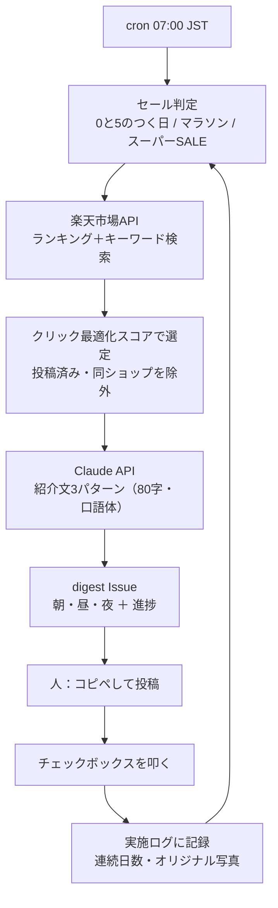
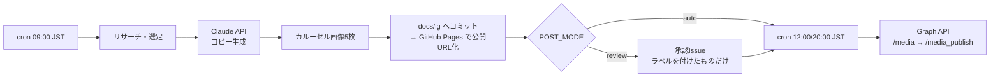

# auto-instagram — 楽天ROOM / Instagram の商品リサーチ・投稿制作 自動化パイプライン

商品リサーチ、紹介文の作成、セールのタイミング判断、進捗管理までを自動化する。
GitHub Actions だけで完結し、サーバーは不要。

用途が2つあり、**片方だけ使ってもよい**。

| | 楽天ROOM | Instagram |
| --- | --- | --- |
| リサーチ・選定 | 自動 | 自動 |
| 紹介文・画像の作成 | 自動 | 自動 |
| **投稿** | **手動（コピペ1タップ）** | **自動** |
| 理由 | 投稿用の公開APIが無く、自動投稿は規約違反 | 公式の Content Publishing API がある |
| 始めるまで | **即日**（無料IDのみ） | Metaのアプリ審査（数日〜2週間） |

---

## Ⅰ. 楽天ROOM：1日15分ルーティンの自動化

毎朝7時、「今日やること」が1通の Issue で届く。



### digest に入っているもの

| セクション | 内容 |
| --- | --- |
| 🎯 イベント | 次のセールまで何日か。**仕込み期間（1〜5日前）**なら方針つきで警告 |
| ☀️ 朝（5分） | 投稿候補2件。商品画像・価格・レビュー・リンク・**紹介文3パターン**（コピペ用） |
| 🛒 買い回り | お買い物マラソン期のみ。**全部ショップが違う**1,000円前後の商品を10件 |
| 🌤 昼（5分） | 「いいね」を誰に押すか。無差別ではなくターゲットの絞り方 |
| 🌙 夜（5分） | 明日の分（前夜のうちに生成済み） |
| 📈 進捗 | 連続投稿日数、今週のオリジナル写真回数、**今日の一手**を1つだけ提示 |
| ✅ 記録 | チェックを付けると実施ログに自動記録される |

### 設計で効かせているポイント

**クリック最適化で選ぶ（`SCORING_PROFILE=click`）**
楽天アフィリエイトの報酬は「リンククリック → 24時間以内にかご → 90日以内に購入」で発生し、
**紹介した商品そのものが売れる必要はない**。クリック後に楽天市場で別の何かが買われても報酬になる。
したがって最適化すべきは成約率ではなく**クリックされる確率**。
`research/score.js` はトレンド（ランキング順位）とレビュー数の重みを上げ、
狙い目価格帯から外れた高額品を減点する。低評価品は信頼を失うので評価も0にはしない。

**セール当日ではなく1〜5日前に仕込む**
ユーザーはセール前に下見をして「いいねリスト」に入れ、開始と同時に買う。
当日投稿では間に合わないため、`room/calendar.js` は**当日イベントより仕込み期間を優先**して方針を出す。

**買い回りは「安さ」ではなく「ショップが全部違うこと」**
お買い物マラソンのポイント倍率は購入した**ショップ数**で決まる。
`selectKaimawari()` はスコア順ではなく、ショップの重複を許さないことを最優先する。

**「今日の一手」を1つに絞る**
全部やれと言われると15分に収まらない。
`room/rank.js` は プロフィール → **オリジナル写真** → 投稿 → いいね の順で、
いま最も効く1つだけを返す。オリジナル写真を最優先に置いているのは、
Bランク到達に最も効くとされる要素だから。

### 紹介文の書き方：ペインファーストと使用体験

「使ってみたら最高でした」と書く代わりに、**使う前のペインを一人称で具体的に描く**のが既定の書き方（pain-first）。

```
1拍目 ペイン（一人称・実感）  朝いちばんに踏んだとき、昨日の湿り気が残ってるのが地味に嫌で
2拍目 ブリッジ（商品データ）  珪藻土なら数十秒で乾くらしくて
3拍目 未来（推量）            これなら朝の一歩目が変わりそう
```

ペインは商品と無関係に本人が本当に感じていることなので、実感を込めて書いても嘘にならない。
読み手の中で「使う前 → 使った後」の像は完成するが、使用の事実は主張していない。
一般的な体験談（「買ってよかった！」）より具体的なぶん、実際にはこちらの方が強い。

**実際に持っている商品は、使用体験として書ける。**
`data/owned-items.json` に登録すると、その商品だけ一人称の使用体験モードに切り替わる。

```json
{ "items": [
  { "match": "珪藻土バスマット", "note": "3ヶ月使用。乾きは早いが端が少し欠けやすい", "since": "2026-06" }
] }
```

`note` に書いた**本人が実際に感じたこと**だけが体験の材料になる。メモが空の登録は無効化される
（材料が無ければ結局LLMが体験を創作することになるため）。
digest には 🟢使用体験 / ⚪️ペインファースト のどちらで書かれたかが表示される。

> **未使用の商品について使用体験を創作しない理由**
> PR表記は「広告であること」の開示であって、体験談の中身が虚偽でよい免罪符ではない。
> 使ってもいない商品の体験を書くのは景品表示法（優良誤認）と楽天アフィリエイト規約の両方に触れる。
> 実務面でも、楽天ROOMのフォロワーは信頼で付くので、一度崩れると積み上げが消える。
> `ROOM_WRITING_MODE=auto` は、**本当の体験を書きやすくする**方向でこの制約を解いている。

### 元ネタとの相違点（正直に書いておく）

| 元の手法 | この実装 | 理由 |
| --- | --- | --- |
| Perplexity に売れ筋を聞く | **楽天ランキングAPIを直接叩く** | AIの要約を挟まず一次データを取る方が速く正確。件数・評価・ショップ・在庫がそのまま使える |
| Perplexity に口コミを分析させる | **商品説明文＋レビュー統計から書く** | 楽天にレビュー本文の公式APIが無い。スクレイピングは規約リスク。「口コミによると」という**根拠のない引用は書かせない**ようにガードした |
| セール日程をAIに聞く | **カレンダー計算＋手入力の確定日程** | 日付固定のイベント（0と5のつく日・ワンダフルデー）は計算できる。日程がずれるマラソン／スーパーSALEは推定として出し、`data/rakuten-events.json` に確定日を書くと上書きされる（推定には必ず `※推定日程` と表示する） |
| 手作業で進捗を意識する | **チェックボックス→ログ→次の一手** | 続くかどうかが成否を分けるので、記録の手間を1タップにした |
| 使用体験として書く | **ペインファースト(未所有時)／使用体験(所有登録時)** | 未使用商品の体験談は景表法・楽天規約に触れる。所有商品を登録すれば本当の体験として書ける |

### セットアップ（即日できる）

1. **無料IDを2つ取る**
   - 楽天ウェブサービス アプリID … https://webservice.rakuten.co.jp/
   - 楽天アフィリエイトID … https://affiliate.rakuten.co.jp/
2. **Secrets を登録**（Settings → Secrets and variables → Actions → Secrets）

   | 名前 | 値 |
   | --- | --- |
   | `RAKUTEN_APP_ID` | 楽天ウェブサービスのアプリID |
   | `RAKUTEN_AFFILIATE_ID` | 楽天アフィリエイトID |
   | `ANTHROPIC_API_KEY` | `sk-ant-...`（https://console.anthropic.com/） |

3. **Variables を登録**（同じ画面の Variables タブ）

   | 名前 | 例 |
   | --- | --- |
   | `RESEARCH_KEYWORDS` | `タンブラー,加湿器,詰め替えボトル,珪藻土` |
   | `ROOM_PERSONA` | `節約と時短を大事にする20〜40代` |
   | `ROOM_POSTS_PER_DAY` | `2` |

4. **試す** — Actions → 「楽天ROOM 今日やること」→ Run workflow（`dry_run: true` で内容だけ確認できる）

これで毎朝7時に digest が届く。以降やることは「コピペして投稿」「チェックを付ける」だけ。

### 手元で確認する

```bash
cd auto-instagram && npm ci
npm run calendar   # 今日の方針とセール日程
npm run rank       # Bランクまでの進捗と今日の一手
npm run digest -- --dry-run   # digest の中身を標準出力に
npm run doctor     # 設定診断
```

### セール日程を確定させる

お買い物マラソンとスーパーSALEは毎回日程がずれる。公式発表が出たら追記する:

```json
{ "events": [
  { "kind": "marathon",  "date": "2026-09-19" },
  { "kind": "superSale", "date": "2026-12-04" }
] }
```

`auto-instagram/data/rakuten-events.json`。未登録の月は推定日程で動き、digest に `※推定日程` と表示される。

---

## Ⅱ. Instagram：生成から投稿まで完全自動

楽天ROOM で使った同じリサーチ結果から、カルーセル投稿（1080×1350・5枚）を生成して自動投稿する。



### 設計上、押さえてほしい3点

**1. 生成と投稿はワークフローが分かれている（分けざるを得ない）**
Instagram Graph API は「インターネットから到達できる公開URLの画像」しか受け付けない。バイナリを直接アップロードする口が無い。
そのため `生成 → コミット＆プッシュ → GitHub Pages 反映 → 投稿` という順序が仕様上必須になる。`data/queue.json` がその継ぎ目。

**2. 既定は完全自動ではなく承認ゲート（`POST_MODE=review`）**
LLM生成をノーチェックで公開アカウントに流すのは、誤情報・法令違反・ブランド毀損のリスクを毎日引くのと同じ。
既定は「候補を Issue に出し、`ig-approved` ラベルを付けたものだけ投稿」。精度に納得できたら `POST_MODE=auto` にする。

**3. ステマ規制（景表法）対応をコード側で強制している**
本文先頭への `【PR】` 挿入と画像への PR バッジ焼き込みは、LLM のプロンプト任せにせず `sanitize()` と `drawPrBadge()` で機械的に必ず行う。

### 使用シーン画像（OpenAI gpt-image-1）

`SCENE_IMAGE_ENABLED=true` にすると、カルーセル表紙の上段に「ペインが解消された生活の一場面」を敷く。
シーンの設計プロンプトはコピー生成と同じ Claude 呼び出しの中で作られるので、追加のLLMコストはかからない。

**楽天の商品画像は入力していない。** 理由は3つ:

1. 楽天アフィリエイトが提供する商品画像は、サイズ変更や周辺への装飾は認められる一方、
   画像そのものの切り取り・画像上への文字入れ・改変は認められていない。AI変換は明確に「加工」にあたる。
2. 著作権法上も、他人の写真をAIで変換して自作物として使うのは翻案の問題が出る。
3. 楽天ROOMのランクアップに効く「オリジナル写真」は**本人が撮影したもの**を指すので、
   他人の商品画像をAI変換しても、そもそもランクアップの目的を満たさない。

代わりに**テキストプロンプトだけから、商品を写さない生活シーンを新規生成する**。
他人の著作物を一切通さないので権利関係がクリーンで、「ペイン解消後の像を見せる」目的はそのまま達成できる。
`image/scene.js` は生成プロンプトに商品名・ロゴ・文字を描かせない制約を必ず付加し、
実写と誤認させないよう既定で「AI生成イメージ」の表示を焼き込む（`SCENE_IMAGE_LABEL=false` で解除可）。

| 設定 | 値 |
| --- | --- |
| Secret `OPENAI_API_KEY` | OpenAI の APIキー |
| Variable `SCENE_IMAGE_ENABLED` | `true` |
| Variable `SCENE_IMAGE_QUALITY` | `low` / `medium`（既定） / `high` |

生成画像は1枚ごとに課金される。パイプライン全体で最も高い費用項目になるので、
`low` で試してから上げること。最新の単価は OpenAI の料金ページを確認してほしい。

### カルーセル表紙のレイアウト（楽天規約対応）

表紙は3段構成で、**文字と装飾は必ず商品画像の外**に置いている。

```
┌──────────────────┐
│ シーン画像 or グラデ  │ ← 自前の画像。見出しを載せてよい
│ [PR] ★4.56         │
│ 大見出し             │
├──────────────────┤
│  商品画像（contain） │ ← 楽天提供画像。切り取らない・文字を載せない
├──────────────────┤
│ 2,480円  スワイプ →  │
└──────────────────┘
```

商品画像は全スライドで `drawImageContain`（切り取りなし）のみを通す。
`drawImageCover`（トリミングあり）が使われるのは自前生成のシーン画像だけ。

### 追加で必要なもの

| 必要なもの | 難易度 |
| --- | --- |
| Instagram プロアカウント（ビジネス/クリエイター） | 5分。個人アカウントは API 非対応 |
| Facebook ページ（Instagram と連携） | 10分 |
| Meta 開発者アプリ + `instagram_business_content_publish` | **アプリ審査が必要。数日〜2週間** |
| GitHub Pages（画像の公開URL用） | Settings → Pages → `main` / `/(root)` |

**Secrets**: `IG_USER_ID` `IG_ACCESS_TOKEN` `META_APP_ID` `META_APP_SECRET`
**Variables**: `PUBLIC_BASE_URL`（例 `https://<ユーザー名>.github.io/jiko-koteikan-app/docs/ig`）、`POST_MODE`、`MAX_POSTS_PER_DAY`

長期アクセストークン（60日）の取得:

```bash
SHORT_LIVED_TOKEN=<グラフAPIエクスプローラで取得した短期トークン> npm run token:exchange
```

`ig-token-check.yml` が毎週月曜に残り日数を確認し、14日を切ったら Issue で通知する。

**やってはいけない代替案**: `instagrapi` 等の非公式ライブラリでログイン自動化する方法が検索すると出てくるが、
利用規約違反でアカウント凍結の実例が多い。楽天ROOM の自動投稿ツールも同様。育てたアカウントを失うので採用していない。

---

## スケジュール

| ワークフロー | 実行時刻(JST) | 内容 |
| --- | --- | --- |
| `room-digest.yml` | 毎日 07:00 | 楽天ROOM の「今日やること」を配信 |
| `room-log-sync.yml` | Issue編集時 | チェックボックス → 実施ログ |
| `ig-build.yml` | 毎日 09:00 | Instagram 投稿の生成 → 承認Issue |
| `ig-publish.yml` | 毎日 12:00 / 20:00 | 承認済みを投稿 → 公開済み画像を掃除 |
| `ig-token-check.yml` | 毎週月曜 09:00 | トークン期限の監視 |

時刻を変える場合は各ワークフローの `cron`（**UTC表記**）を編集する。JST = UTC+9。

---

## 想定コスト

| 項目 | 月額目安 |
| --- | --- |
| GitHub Actions | 0円（パブリックリポジトリは無料。プライベートでも月2000分の枠内） |
| Claude API | 楽天ROOM のみ: 約100〜200円 / 両方: 約200〜400円 |
| 楽天API・GitHub Pages | 0円 |

---

## 誤爆を防ぐために入れてある仕掛け

| 仕掛け | 場所 | 目的 |
| --- | --- | --- |
| 事実の固定 | `content/prompt.js` `content/room.js` | 与えた商品データ以外の事実を書かせない |
| 未所有商品の使用体験を除去 | `content/room.js` `sanitizeRoom()` | 「愛用しています」「楽になりました」を機械的に落とす。所有登録済みの商品では適用しない |
| 所有登録のメモ必須化 | `store/owned.js` | メモが空の登録は無効。材料が無いまま体験を書かせない |
| 商品画像を加工しない | `image/render.js` | 楽天提供画像は `contain` のみ。文字・装飾は画像の外 |
| シーン画像に商品を描かせない | `image/scene.js` | プロンプトにロゴ・文字・商品を禁じる制約を必ず付加 |
| AI生成の明示 | `image/scene.js` | 実写と誤認させないため既定で表示を焼き込む |
| 引用の捏造を除去 | 同上 | 「口コミによると」を許さない（レビュー本文は取得していないため） |
| 禁止表現の機械除去 | `content/generate.js` `sanitize()` | 「日本一」「完治」等をプロンプト任せにしない |
| 価格の突合警告 | 同上 | LLMが数値を書き換えたら警告 |
| 薬機法リスク商品の除外 | `research/score.js` | 医薬品的な商品名を候補から外す |
| 文字数の強制 | `sanitizeRoom()` | 80字を超える紹介文は必ず丸める |
| 同一商品・同一ショップの再投稿防止 | `store/history.js` | 「同じ物ばかり」を防ぐ |
| 承認ゲート | `publish/review.js` | Instagram は公開前に人が1回見る |
| 1日の投稿上限 / 3回失敗で打ち切り | `config.js` `pipeline.js` | API上限を焼かない |
| 失敗のIssue化・トークン期限監視 | `publish/review.js` / `ig-token-check.yml` | 静かに止まる事故を防ぐ |

---

## トラブルシュート

| 症状 | 原因と対処 |
| --- | --- |
| digest が届かない | Actions のログを確認。`RAKUTEN_APP_ID` / `ANTHROPIC_API_KEY` 未設定が最多 |
| `候補商品が0件` | 絞り込みが厳しい。`RESEARCH_MIN_REVIEW_COUNT` を下げるかキーワードを増やす |
| チェックが記録されない | Issue に `room-digest` ラベルが付いているか確認（無いと `room-log-sync` が動かない） |
| セール日程が実際とずれる | `※推定日程` の表示が出ているはず。`data/rakuten-events.json` に確定日を追記 |
| 画像の日本語が □ になる | フォント未導入。CI は `fonts-noto-cjk` を入れている。ローカルは `FONT_PATH_BOLD` を指定 |
| `公開URLに到達できませんでした` | GitHub Pages が未設定／`PUBLIC_BASE_URL` の綴り違い |
| Instagram の投稿が突然止まった | まずトークン失効を疑う。`npm run token:check` |

---

## ディレクトリ

```
auto-instagram/
├── src/
│   ├── config.js            設定の一元管理・検証
│   ├── pipeline.js          roomDigest / build / publish / doctor
│   ├── cli.js               コマンド入口
│   ├── room/
│   │   ├── calendar.js      楽天セール日程・仕込みタイミング判定
│   │   ├── rank.js          Bランク進捗・「今日の一手」
│   │   └── digest.js        朝/昼/夜 digest の組み立て
│   ├── research/            楽天API・クリック最適化スコアリング・買い回り選定
│   ├── content/             プロンプト・Claude呼び出し・検品（room.js が楽天ROOM用）
│   ├── image/               フォント解決・描画・テンプレート・シーン画像生成(scene.js)
│   ├── publish/             Instagram Graph API・Issue操作
│   └── store/               投稿履歴・キュー・所有商品(owned.js)
├── scripts/                 トークン交換／期限確認／画像掃除／チェック読み戻し
├── test/                    ユニット + E2E（外部APIは全モック）47件
└── data/                    history / queue / room-log / rakuten-events / owned-items
```

## コマンド

```bash
# 楽天ROOM
npm run digest              # 今日やることを Issue で配信
npm run digest -- --dry-run # 中身を標準出力に
npm run calendar            # セール日程と今日の方針
npm run rank                # 進捗と今日の一手

# Instagram
node src/cli.js build --count 2      # 2件生成
node src/cli.js publish --slug xxx   # 1件だけ投稿

# 共通
npm run doctor              # 設定診断
npm test                    # 47件
```
