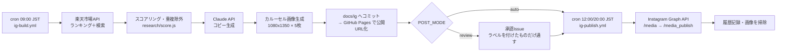

# auto-instagram — 商品リサーチ → 投稿生成 → 定時投稿 の自動パイプライン

商品を自動で探し、Instagram のカルーセル投稿（画像＋本文）を自動で作り、決まった時刻に自動投稿する仕組み。
GitHub Actions だけで完結し、サーバーは不要。



## 設計上、ここだけは押さえてほしい 3 点

**1. 生成と投稿はワークフローが分かれている（分けざるを得ない）**
Instagram Graph API は「インターネットから到達できる公開URLの画像」しか受け付けない。バイナリを直接アップロードする口が無い。
そのため `生成 → コミット＆プッシュ → GitHub Pages 反映 → 投稿` という順序が仕様上必須になる。1つのプロセスでは完結できないので、`data/queue.json` を継ぎ目にして `build` と `publish` に分けている。

**2. 既定は「完全自動」ではなく承認ゲート付き（`POST_MODE=review`）**
LLM生成をノーチェックで公開アカウントに流すのは、誤情報・薬機法/景表法違反・ブランド毀損のリスクを毎日引くのと同じ。回収コストが自動化の利得を上回りやすい。
そこで既定は「候補を GitHub Issue に出し、`ig-approved` ラベルを付けたものだけ投稿する」。承認は Issue にラベルを1つ付けるだけ＝スマホから10秒で終わる。精度に納得できたら `POST_MODE=auto` に切り替えれば完全自動になる。

**3. ステマ規制（景品表示法）対応をコード側で強制している**
2023年10月施行のステマ規制により、アフィリエイト投稿には広告である旨の明示が必要。
本文先頭への `【PR】` 挿入と画像への PR バッジ焼き込みは、LLM のプロンプト任せにせず `sanitize()` と `drawPrBadge()` で機械的に必ず行う。設定 `CONTENT_DISCLOSURE_REQUIRED` は false にできるが、アフィリエイト運用では法令違反になり得るので触らないこと。

---

## 前提条件（ここが実運用の最大の壁）

| 必要なもの | 取得先 | 難易度・所要時間 |
| --- | --- | --- |
| Instagram **プロアカウント**（ビジネス/クリエイター） | Instagramアプリの設定 | 5分。個人アカウントは API 非対応 |
| Facebook ページ（Instagramと連携） | facebook.com | 10分 |
| Meta 開発者アプリ + `instagram_business_content_publish` 権限 | developers.facebook.com | **アプリ審査が必要。数日〜2週間** |
| 楽天ウェブサービス アプリID | webservice.rakuten.co.jp | 即日・無料 |
| 楽天アフィリエイトID | affiliate.rakuten.co.jp | 即日・無料 |
| Anthropic API キー | console.anthropic.com | 即日 |

> **審査を通していない間**は `POST_MODE=review` かつ手動投稿で運用できる。
> 生成された画像は `docs/ig/<slug>/` に、本文は承認Issueに揃っているので、
> それをコピーして手で投稿すれば「リサーチと制作だけ自動」の状態で今日から使える。
> 審査が通ったら Secrets を足すだけで投稿まで自動になる。

**やってはいけない代替案**: `instagrapi` 等の非公式ライブラリでログイン自動化する方法が検索すると出てくるが、Instagram の利用規約違反で、アカウント凍結の実例が多い。育てたアカウントを失うので採用していない。

---

## セットアップ

### 1. 各種IDを取得して GitHub に登録

**Settings → Secrets and variables → Actions → Secrets**（秘匿値）

| 名前 | 値 |
| --- | --- |
| `RAKUTEN_APP_ID` | 楽天ウェブサービスのアプリID |
| `RAKUTEN_AFFILIATE_ID` | 楽天アフィリエイトID |
| `ANTHROPIC_API_KEY` | `sk-ant-...` |
| `IG_USER_ID` | Instagram ビジネスアカウントID（17桁前後の数値） |
| `IG_ACCESS_TOKEN` | 長期アクセストークン（後述） |
| `META_APP_ID` / `META_APP_SECRET` | Meta 開発者アプリのもの（トークン期限チェックに使用） |

**Variables**（秘匿不要な設定）

| 名前 | 例 |
| --- | --- |
| `PUBLIC_BASE_URL` | `https://<ユーザー名>.github.io/jiko-koteikan-app/docs/ig` |
| `POST_MODE` | `review`（慣れたら `auto`） |
| `MAX_POSTS_PER_DAY` | `2` |
| `RESEARCH_KEYWORDS` | `タンブラー,加湿器,デスクライト` |
| `BRAND_PERSONA` | アカウントの口調 |

### 2. GitHub Pages を有効化

**Settings → Pages → Source: `Deploy from a branch` / Branch: `main` / Folder: `/ (root)`**

リポジトリのルートを配信対象にすると、既存の `index.html`（鋼の自己肯定感アプリ）はそのまま生き、
生成画像は `https://<ユーザー名>.github.io/jiko-koteikan-app/docs/ig/...` で配信される。
この URL を `PUBLIC_BASE_URL` に設定する。

### 3. Instagram の長期アクセストークンを作る

```bash
cd auto-instagram
cp .env.example .env      # META_APP_ID / META_APP_SECRET を記入
SHORT_LIVED_TOKEN=<グラフAPIエクスプローラで取得した短期トークン> npm run token:exchange
```

出力された長期トークン（60日）を Secrets の `IG_ACCESS_TOKEN` に設定する。
`ig-token-check.yml` が毎週月曜に残り日数を確認し、14日を切ったら Issue で通知する。

### 4. 動作確認

```bash
cd auto-instagram
npm ci
npm test          # 15件のテスト（画像生成・法令チェック・パイプライン結線）
npm run doctor    # 設定・トークン・フォントの健全性チェック
```

GitHub 上では **Actions → 「IG 投稿を生成」→ Run workflow** で `dry_run: true` を選んで試せる。
生成された画像は `docs/ig/` にコミットされる。

### 5. 本番稼働

そのまま置いておけば以下のスケジュールで動く。

| ワークフロー | 実行時刻(JST) | 内容 |
| --- | --- | --- |
| `ig-build.yml` | 毎日 09:00 | 商品リサーチ → 投稿生成 → 承認Issue作成 |
| `ig-publish.yml` | 毎日 12:00 / 20:00 | 承認済みを投稿 → 公開済み画像を掃除 |
| `ig-token-check.yml` | 毎週月曜 09:00 | トークン期限の監視 |

時刻を変える場合は各ワークフローの `cron`（**UTC表記**）を編集する。JST = UTC+9。

---

## 日々の運用

1. 朝、`[IG投稿承認]` の Issue が届く（画像プレビューと本文つき）
2. 良ければ `ig-approved` ラベルを付ける／不要なら Issue を close する
3. 昼と夜の publish ジョブが、ラベル付きのものだけを投稿する
4. 投稿されると Issue に URL がコメントされて自動で閉じる

### 手動操作

```bash
node src/cli.js build --count 2      # 2件生成
node src/cli.js publish --slug xxx   # 1件だけ投稿
node src/cli.js build --dry-run      # 生成のみ（Issueも投稿もしない）
node src/cli.js doctor               # 設定診断
node scripts/prune.js                # 公開済み画像の掃除
```

---

## 想定コスト

| 項目 | 月額目安（1日2投稿） |
| --- | --- |
| GitHub Actions | 0円（パブリックリポジトリは無料。プライベートでも月2000分の枠内） |
| Claude API | 約50〜150円（1投稿あたり 入力1k/出力1.5k トークン程度） |
| 楽天API・GitHub Pages | 0円 |

---

## 誤爆を防ぐために入れてある仕掛け

| 仕掛け | 場所 | 目的 |
| --- | --- | --- |
| 承認ゲート | `publish/review.js` | 公開前に人が1回見る |
| 事実の固定 | `content/prompt.js` | 与えた商品データ以外の事実を書かせない |
| 禁止表現の機械除去 | `content/generate.js` `sanitize()` | 「日本一」「完治」等をプロンプト任せにしない |
| 価格の突合警告 | 同上 | LLMが数値を書き換えたら警告を出す |
| 薬機法リスク商品の除外 | `research/score.js` | 医薬品的な商品名を候補から外す |
| 同一商品・同一ショップの再投稿防止 | `store/history.js` | 「同じ物ばかり」を防ぐ |
| 1日の投稿上限 | `config.js` `limits` | API上限50件に対し既定2件 |
| 3回失敗で打ち切り | `pipeline.js` | 無限リトライで投稿枠を焼かない |
| 失敗のIssue化 | `publish/review.js` | 静かに止まる事故を防ぐ |
| トークン期限監視 | `ig-token-check.yml` | 自動投稿が止まる最大の原因を先回り |

---

## トラブルシュート

| 症状 | 原因と対処 |
| --- | --- |
| 画像の日本語が □ になる | フォント未導入。CI は `fonts-noto-cjk` を入れている。ローカルは `FONT_PATH_BOLD` を指定 |
| `公開URLに到達できませんでした` | GitHub Pages が未設定／`PUBLIC_BASE_URL` の綴り違い。ブラウザで画像URLを直接開いて確認 |
| `(#10) Application does not have permission` | Meta アプリ審査が未通過、または権限不足 |
| `Media ID is not available` | コンテナ処理の待ち不足。`IG_CONTAINER_TIMEOUT_SEC` を延ばす |
| `候補商品が0件` | 絞り込みが厳しい。`RESEARCH_MIN_REVIEW_COUNT` を下げるかキーワードを増やす |
| 投稿が突然止まった | まずトークン失効を疑う。`npm run token:check` |

---

## ディレクトリ

```
auto-instagram/
├── src/
│   ├── config.js            設定の一元管理・検証
│   ├── pipeline.js          build / publish / doctor の本体
│   ├── cli.js               コマンド入口
│   ├── research/            楽天API・スコアリング
│   ├── content/             プロンプト・Claude呼び出し・検品
│   ├── image/               フォント解決・描画プリミティブ・テンプレート
│   ├── publish/             Instagram Graph API・承認ゲート
│   └── store/               投稿履歴・キュー
├── scripts/                 トークン交換／期限確認／画像掃除
├── test/                    ユニット + E2E（外部APIはモック）
└── data/                    history.json / queue.json（コミットされる）
```
